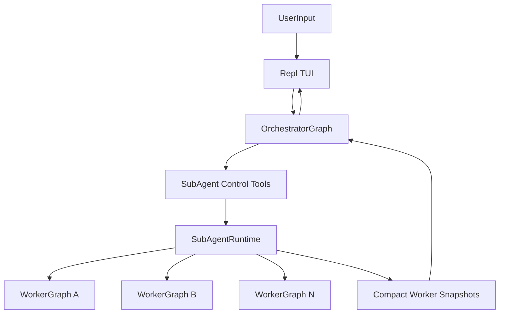

# Parallel Sub-Agent Implementation Report

## Scope

This report documents the current experimental parallel sub-agent implementation in LLC, including architecture, runtime behavior, safeguards, and known limitations.

The feature set is experimental and currently opt-in via `/enable sub-agent-mode` or `SUB_AGENT_MODE_ENABLED=true`.

## Objectives Implemented

- Add orchestrator-managed worker execution with parallel worker tasks.
- Keep workers isolated and independent.
- Support manual worker spawn with strict command syntax.
- Provide worker progress visibility in a dedicated TUI side panel.
- Bound worker reporting payloads to protect context length.
- Preserve orchestrator ability to work directly (delegation is optional).

## Architecture Overview

Core components:

- `llc/ui/repl.py`
  - initializes session runtime
  - builds orchestrator/worker graphs
  - renders a toggleable side panel with active/past worker cards
- `llc/agent/graph.py`
  - role-aware graph construction (`default`, `orchestrator`, `subagent`)
  - injects live worker snapshot into orchestrator system prompt per turn
- `llc/agent/subagents/runtime.py`
  - worker lifecycle manager
  - parallel execution via thread pool + async worker loops
  - reporting, revision, interruption, termination
- `llc/agent/tools/subagents.py`
  - orchestration tool surface for orchestrator
- `llc/commands/enable.py`
  - `/enable sub-agent-mode`
- `llc/commands/subagent.py`
  - strict `/subagent {TASK}` manual spawn

## Prompt and Role Strategy

- The system uses the main `llc/prompts/system_prompt.yaml` as the base prompt.
- Role behavior is added as inline prompt modifiers at graph build time:
  - orchestrator mode append
  - isolated-task execution append for workers
- Separate role-specific prompt files were intentionally removed.

## Worker Isolation Guarantees

Implemented safeguards:

- Worker graphs do not receive sub-agent control tools.
- Worker context payload is built from user messages only.
- Context sanitization strips orchestration terms (`subagent`, `/subagent`, `orchestrator`, etc.).
- No worker-to-worker communication paths exist in the runtime.

## Commands and UX

### Mode Toggle

- `/enable sub-agent-mode`
  - updates settings in-session
  - rebuilds graph in orchestrator role

### Manual Worker Spawn

- `/subagent {TASK}`
  - strict brace requirement
  - validates non-empty payload
  - launches one worker per command
  - enforces max active workers
  - auto-starts an orchestrator follow-up response after successful launch, so worker completion does not require a manual poll turn

### TUI Progress Rendering

- Side panel is toggled with `Ctrl+G` or the `Agents` button.
- `Active Sub-Agents` lists running/restarting/terminating workers, or an explicit empty-state line when none are active.
- `Past Sub-Agents` retains terminal workers (`completed`, `failed`, `terminated`, `stuck`) until user dismissal.
- Each worker card shows concise goal/activity preview, supports expand-for-details, and marks terminal states as `Agent de-spawned`.
- Banner token/cost totals include sub-agent token usage (worker execution plus completion-report calls), when pricing data is available.

### Session Interrupt Hotkey

- Pressing `Esc` twice in quick succession triggers a session interrupt.
- The interrupt attempts to:
  - cancel the active orchestrator turn worker,
  - terminate all active sub-agents,
  - append the prompt: `Session Interrupted, what should be done differently?`

### Turn Model

- The app remains turn-based for normal chat.
- If the orchestrator has active workers during a response, the same orchestrator response is kept open until workers complete.
- Live worker status cards continue updating in the side panel while the orchestrator is waiting.
- The orchestrator resumes and emits completion output without requiring a manual poll turn.

## Sub-Agent Runtime Lifecycle

Each worker record tracks:

- identifier
- goal/task
- status + attempt count
- progress metadata
- final output and compact completion result
- timestamps and stop reason

Supported operations:

- launch
- report
- wait
- revise
- interrupt
- terminate

Runtime behavior:

- parallel worker execution (`ThreadPoolExecutor`, max workers from settings)
- stop signaling via per-worker event
- restart flow on revision feedback
- max-runtime stop handling for stuck workers

## Context Growth and Reporting Controls

To prevent context blowups in orchestrator history:

- Worker report payloads are compact snapshots.
- Success snapshots focus on:
  - `goal`
  - `final_result`
  - minimal metadata (`id`, `status`, `attempt`)
- Verbose fields are preview-truncated when included.
- Full worker `final_output` is capped.
- Revision inputs (feedback/prior output) are capped before reinjection.
- Report list size is bounded (active + small recent window by default).

## Completion Report Hook

On successful worker completion:

- runtime performs a bounded follow-up LLM call
- input uses:
  - worker goal
  - worker final output
  - bounded worker transcript
- output is a compact normalized completion report
- timeout + fallback are in place to avoid stalling lifecycle completion

This improves uniformity of worker outcomes while limiting token impact.

## Compaction Behavior Improvements

`llc/agent/compact.py` includes split adjustment logic to better compact oversized retained messages when possible, reducing cases where compaction appears ineffective after payload spikes.

## Live Worker Snapshot for Orchestrator

`llc/agent/graph.py` injects a live runtime snapshot into the orchestrator system prompt every model turn, so worker status is available immediately without waiting for an explicit status tool call.

## Configuration Surface

From `.env`:

- `SUB_AGENT_MODE_ENABLED`
- `MAX_SUB_AGENTS` (hard-capped at 5)
- `SUB_AGENT_REPORT_INTERVAL_S`
- `SUB_AGENT_MAX_RUNTIME_S`
- `SUB_AGENT_CONTEXT_MESSAGES`

## Current Limitations

- No persistent worker state across app restarts.
- No worker-to-worker collaboration layer yet.
- Completion report hook adds one extra model call per successful worker completion.

## Verification Performed

Validation run during implementation included:

- module compilation checks (`compileall`)
- linter diagnostics on modified files
- runtime smoke checks for:
  - launch/report/wait/revise/terminate
  - max-worker enforcement
  - strict manual command parsing
  - compact report payload shape

## Suggested Next Iterations

- Add optional auto-notify on worker completion in TUI.
- Add configurable report format templates.
- Add persisted runtime checkpoints for long-running sessions.
- Add explicit orchestrator command to list workers/results without model mediation.
